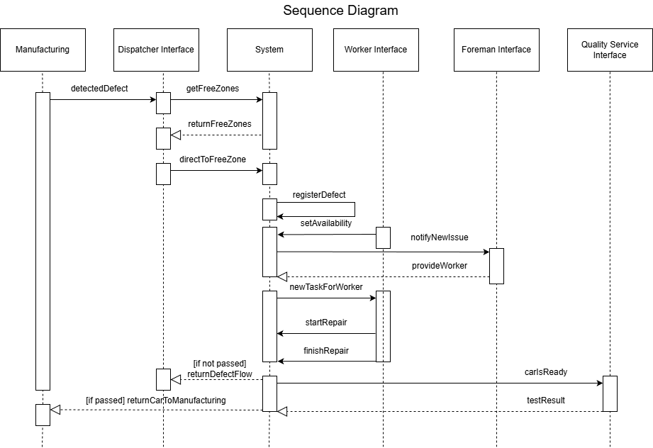
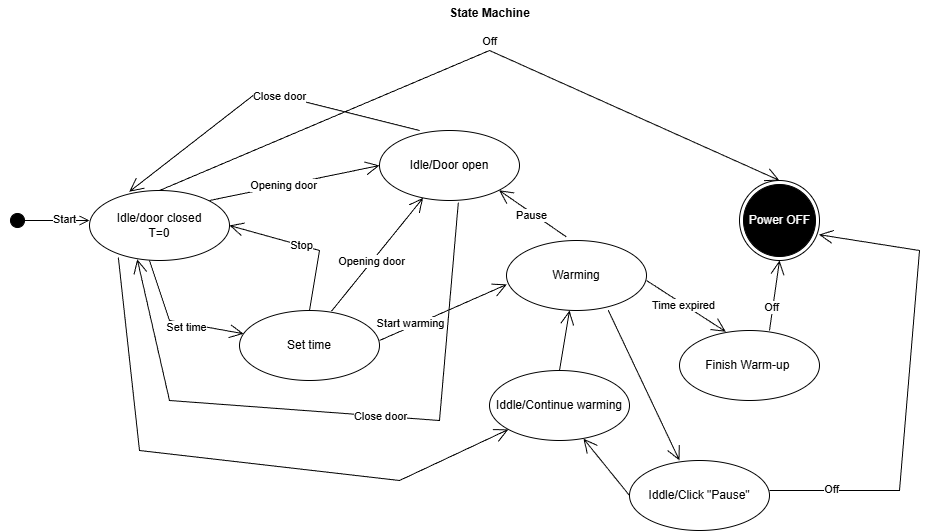
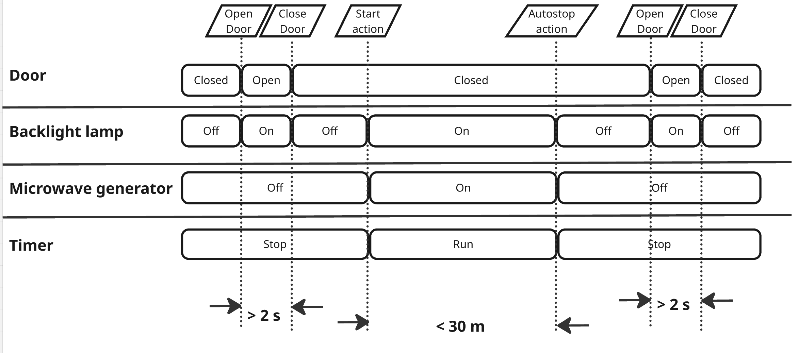
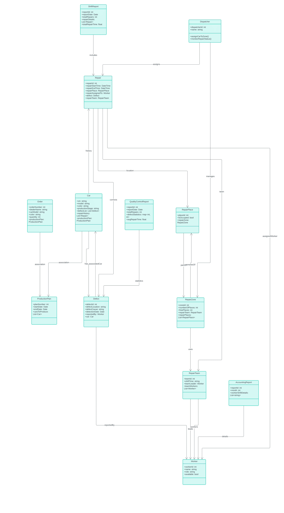
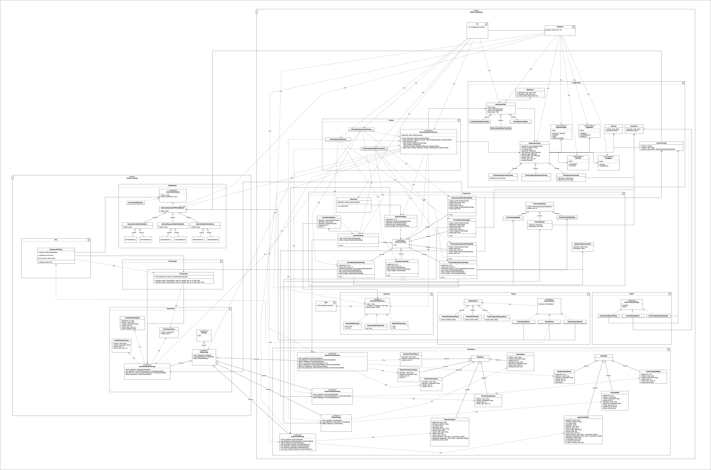

1. [Диаграмма последовательностей](./sequence_diagram.png)

# Диаграмма последовательностей

Данная диаграмма отражает процесс регистрации дефекта на производственной линии и выполнения ремонта автомобиля.

## Описание

- Производство обнаруживает дефект автомобиля и передает информацию диспетчеру.
- Диспетчер определяет наличие свободной ремонтной зоны, запрашивая данные у системы, и направляет автомобиль в доступную ремонтную зону.
- Система регистрирует дефект и фиксирует начало/окончание ремонта.
- Рабочий отмечает свою доступность для получения задачи.
- Система уведомляет бригадира о новом дефекте, бригадир назначает рабочего.
- Система отправляет назначенному рабочему задачу.
- Рабочий выполняет ремонт и завершает его, передавая результаты в систему.
- После ремонта система направляет автомобиль на проверку ОТК.
- Отдел контроля качества проводит тестирование и передает результат в систему.
- Если проверка **пройдена** - система возвращает автомобиль на конвейер.
- Если проверка **не пройдена** - система инициирует повторный цикл ремонта.

2. [Диаграмма конечных автоматов](./state_maschine.png)

# Диаграмма конечных автоматов

Диаграмма конечных автоматов описывает поведение микроволновки.

## Состояния

- **Idle / door closed (T=0)** - микроволновка выключена, дверь закрыта, время не задано.
- **Idle / door open** - устройство ожидает закрытия двери.
- **Set time** - установка времени нагрева.
- **Warming** - нагревание.
- **Idle / click "Pause"** - пауза во время нагрева.
- **Idle / continue warming** - возобновление нагрева после паузы.
- **Finish warm-up** - завершение нагрева после истечения времени.
- **Power OFF** - выключенное состояние устройства.

## Переходы

- Открытие и закрытие двери переключает между состояниями *Idle/door closed* и *Idle/door open*.
- Из состояния ожидания можно перейти к установке времени (*Set time*).
- После задания времени доступен переход к нагреву (*Start warming*).
- Во время нагрева возможны:
  - *Pause* - переход в *Idle / click "Pause"*.
  - *Opening door* - автоматическая пауза нагрева из-за открытия двери.
  - *Time expired* - переход в *Finish warm-up*.
- Из *Pause* можно:
  - продолжить нагрев *Idle / continue warming* -> *Warming*,
  - выключить устройство, не продолжая нагрев по заданному таймингу -> *Power OFF*.
- Из любого состояния возможен переход в *Power OFF* (команда *Off*).
- После завершённого нагрева устройство автоматически переходит в *Power OFF*.

3. [Временная диаграмма](./timing_diagram.png)

# Временная диаграмма

Был выбран стандартный сценарий разогрева со следующими объектами:
- Door (Дверца)
- Backlight lamp (Лампа подсветки)
- Microwave Generator (СВЧ генератор)
- Timer (Таймер работы)

Происходящие события:
- Открытие дверцы
- Закрытие дверцы
- Включение микроволновки
- Автоотключение микроволновки

4. Описание диаграммы классов

- **ShiftReport** - нет смысла в `totalRepairs`, его можно получить из количества `repairDetails`
- **Repair** - нет смысла в `repairTeam`, т.к. по работнику можно однозначно понять в какой он бригаде
- **Car** - неясно зачем список дефектов, мы храним машины для истории, значит достаточно информации о починках, в которых уже есть информация о дефектах
Нет никакой информации о смене, привязке бригад к местам на смену, что может быть нужно для истории
- **QualityControlReport** - нет информации о починках, только о дефектах, нет смысла хранить количество ремонтов отдельно
- **AccountingReport** - нет информации о сотрудниках, только какой-то текст, то есть сильно сложнее соединить с сотрудниками
Отчеты не связаны со сменами
- **RepairZone** и **RepairPlace** - нет смысла хранить `numberOfPlaces` и `freePlaces`, они вычисляются из всего остального
Роль сотрудника - строка, хотя можно было сделать отнаследованными классами, чтобы было надежнее и можно было хранить специфичную для должности информацию
- **RepairTeam** - `shiftTime` почему-то строка
- **defectStatistics**: `Map<int,int>` - непонятно что за инты

5. Описание mad-диаграммы

Эта диаграмма абсолютно нечитабельная

Выглядит как система для проведения и тестирования экспериментов. Мы можем указать какая местрика для нас приоритетная - какое-то крит. значение, время, выч. ресурсы. У нас есть генерация данных для тестов, создаются различные виды выборок. По результата собирается статистика. Все выборки сохраняются в своих форматах после тестов, чтобы видимо можно было их изучить. После тестов можно получить отчет о результатах тестирования
Система упрощает процесс тестирования гипотез - задал конфигурацию, система сгенерировала данные, прогнала тесты и выдала отчет

Компоненты:
* Configuration – отвечает за конфигурацию эксперимента(тип эксперимента, тип распределения, параметры)
* Experiments – абстракции самих экспериментов и процесс их выполнения
* Generators – по конфигурации создаёт генераторы выборок для разных распределений
* Statistics / Calculators – стратегии расчёта метрик (крит. значение, мощность, время)
* Persistence – хранилище конфигураций, выборок и результатов
* Reporting – построение отчётов по сохранённым данным
* GUI – пользовательский интерфейс
* Validation - проверка корректности введённых параметров

Абстракции:
* ExperimentStep - абстракция для проведения эксперимента, не нужно знать как проводится шаг эксперимента, нужно только его провести
* AbstractRVSGenerator - абстракция для генерации данных
* AbstractReportBuilder - абстракция для построения разных отчетов
* IDataStorage - абстракция для хранения данных, от которой уже есть абстракции для хранения конкретных видов данных (IRandomValueStorage, ITimeComplexityStorage, * IPowerStorage, IExperimentStorage, ILimitDistributionStorage)
* AbstractExperimentFactory - абстракция для фабрик создания экспериментов

Фабрики:
* Есть фабрики для создания экспериментов

Принцип работы системы выглядит как-то так
* В UI задаем конфигурацию
* В Validation валидируем конфигурацию
* Создаем эксперимент по конфигурации
* Генерируем выборки для эксперимента
* Проводим эксперимент
* Сохраняем результаты эксперимента
* Строим отчет по результатам эксперимента
