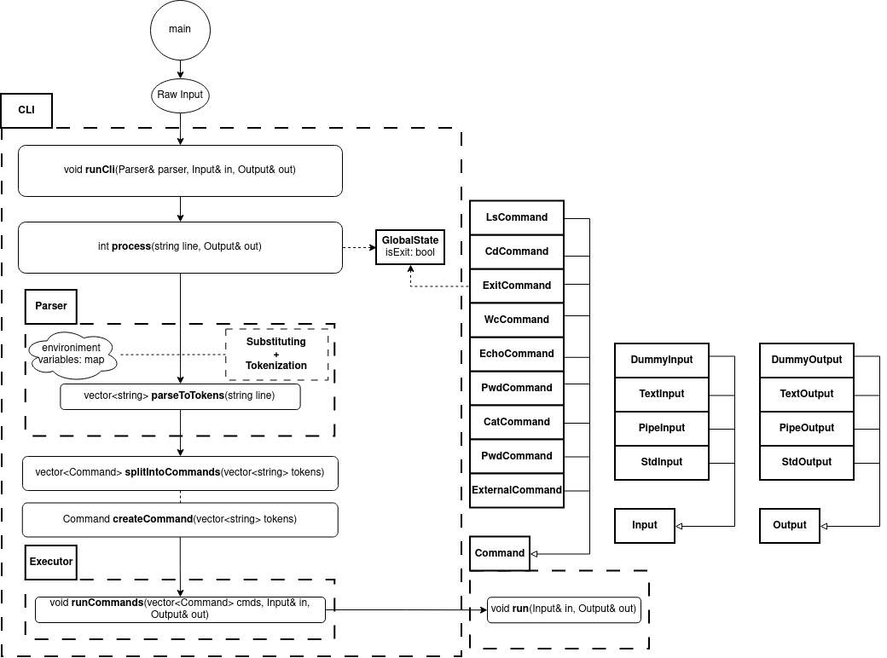
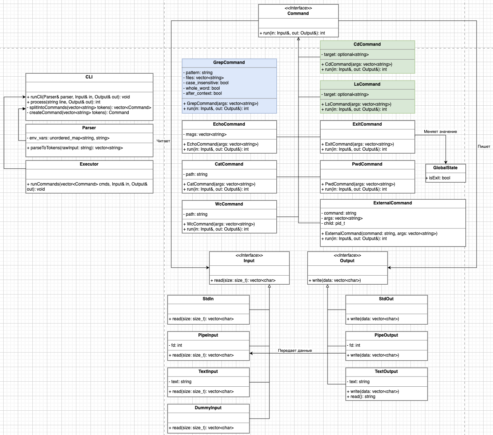

### Архитектура
1. [Архитектурная диаграмма](cli.png "CLI")

2. [Диаграмма классов](class-diagram.png "Classes")

### Общее описание работы
1. В функции `main` создаются `Input` и `Output` для `stdin` и `stdout`, а так же парсер (так сделано для упрощения тестирования), которые затем передаются в функцию `runCli`.
2. Функция `runCli` является главной функцией обработки. В цикле, пока не проставлен флаг о завершении работы, читает по строке из `Input` и передает ее вместе с парсером и `Output` в функцию `process(line, out)`.
3. Функция `process(line, out)` сначала вызывает `Parcer::parseToTokens(lines)`, чтобы парсер вычитал новые переменные, совершил подстановку переменных, а затем разбил строку на токены по пробелам с учетом строковых аргументов. Подстановка и парсинг объединены, т.к. для подстановки нам нужно найти аргументы (нужно учитывать, что в тексте может быть написано, например `echo '$var'`, и здесь не надо подставлять значение), а для разбиения на элементы нам нужна полная подстановка (пример с `$x$y = exit` в задании). Переменные окружения представляются в строковом виде и хранятся как пары ключ-значения внутри парсера.
4. После этого вызывается функция `splitIntoCommands(tokens)`, которая разделяет токены по `"|"`. Для каждый группы токенов вызываем создаётся команда, тип которой определяется по нулевому токену. Если команда известна для CLI, то создаем объект нужного класса с помощью `createCommand`, куда в качестве параметров передаются остальные токены группы. Там же происходит их валидация в зависимости от специфики конкретной команды. Если же команда неизвестна, то создается объект `ExternalCommand`, которому в качестве команды передается нулевой токен, а в качестве аргументов все остальные токены группы. `ExitCommand` будет только проставлять флаг `isExit`, чтобы завершить обработку данных. Для добавления новой команды нужно создать соответствующий новый класс, а так же добавить поддержку в `createCommand(tokens)`.
5. После того как мы получили все команды, вызывается функция `Executor::runCommands(commands, in, out)`. В ней для каждой последовательной пары команд создается `pipe`. Для первой команды передаем в качестве входа `DummyInput`, который будет кидать исключение при чтении. Это необходимо, т.к. каждая команда должна получать при запуске вход и выход, даже первая, у которой нет входа (может быть заменено в случае поддержки функциональности `cli < a.txt`). Для последней команды на выход подается изначальный `Output` созданный в `main`.
6. Многопоточная обработка в CLI может реализовываться следующим образом:
    1) Заводим по потоку на каждую команду и запускаем пайплайн, подав входной поток на Input первой команде.
    2) В ходе выполнения команды будут записывать часть данных в Output. Так как Output может быть пайпом, то следующая команда уже сможет прочитать эти данные и начать исполняться параллельно текущей.

### Описание сущностей
#### Общие классы
- `CLI` - обобщающая сущность, реализующая необходимую функциональность cli. Содержит в себе классы `Parser` и `Executor` и утилитарные функции.
- `Parser` - занимается установкой переменных (т.к. они непосредственно влияют только на результат парсинга), подстановкой перменных в строке(т.к. для подстановки надо понимать находимся ли мы внутри строки или нет), разбиением строки на токены.
- `Executor` - умеет исполнять задачи. Позволит в будущем поменять стратегию исполнения команд, если появится такой запрос.
- `GlobalState` - хранит глобальное состояние программы (пока что только флаг о завершении работы).
#### Интерфейсы
- `Command` - предоставляет интерфейс для запуска комманд.
- `Input` - предоставляет интерфейс чтения данных.
- `Output` - предоставляет интерфейс записи данных.
#### Конкретные реализации
- `EchoCommand` - реализует `Command`, выполняет при запуске операцию echo.
- `CatCommand` - реализует `Command`, выполняет при запуске операцию cat.
- `WcCommand` - реализует `Command`, выполняет при запуске операцию wc.
- `LsCommand` - реализует `Command`, выполняет при запуске операцию ls.
- `CdCommand` - реализует `Command`, выполняет при запуске операцию cd.
- `ExitCommand` - реализует `Command`, команда, при запуске проставляющая флаг isExit в глобальном состоянии.
- `PwdCommand` - реализует `Command`, выполняет при запуске операцию pwd.
- `ExternalCommand` - реализует `Command`, запускает внешнюю команду. Нужна в случае, если вызванная команда не поддержана cli.
- `StdIn` - реализует `Input`, позволяет читать из stdin.
- `PipeInput` - реализует `Input`, позволяет читать из pipe.
- `TextInput` - реализует `Input`, нужен для тестов, позволяет задать вход для конкретной команды или для всего процессинга.
- `DummyInput` - реализует `Input`, нужен для запуска процесса выполнения команд, т.к. у первой команды нет входа (может быть заменен на чтение из файла, если будет требование на <, пример: wc < a.txt).
- `StdOut` - реализует `Output`, позволяет писать в stdout.
- `PipeOutput` - реализует `Output`, позволяет писать в pipe.
- `TextOutput` - реализует `Output`, нужен для тестов, чтобы проверить совпадение результатов выполнения кода с эталоном.
